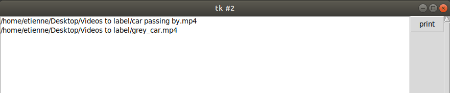

# Label Tool 

Label tool is a basic and free labelling tool for videos, very intuitive to use it allows to label video with a bounding box around one object, it handles directly the video file and integrate a tracking tool that allow to do the labelling step faster.


## Installation of the dependencies 

```
pip3 install -r requirements.txt
```

### Running LabelTool

```
python3 Labelling.py
```

You are then invated to select the **Folders** where you store the Labels and the Videos. The program will then compare the two and give you a list of videos that are not been labelled yet, you just have to select a video from the list to start. 



You have then the labelling tool open with the frame number on the top left in red. 

Commands : 

| Key  | Command  | Comment                                         |
| ---- | -------- | ----------------------------------------------- |
| v    | Validate | Validate this labelisation and go to next frame |
| s    | Select   | Select the object on the image                  |
| d    | Delete   | Delete current selection                        |
| b    | Backward | Go back of 1 frame                              |
| q    | Quit     | Quit and save labelisation process              |

When you finished your Labels are saved in a csv file with a name base on the name of the video. 

Labels are stored in the form

`Frame_nb`, `position` with position format as `(x,y,w,h)`

#### Visualize Labelisation

If you want to control a labelisation you can use : 

```
python3 Visualize.py
```

The program will find back the video based on the original video folder and display the labelisation along with the video. 

